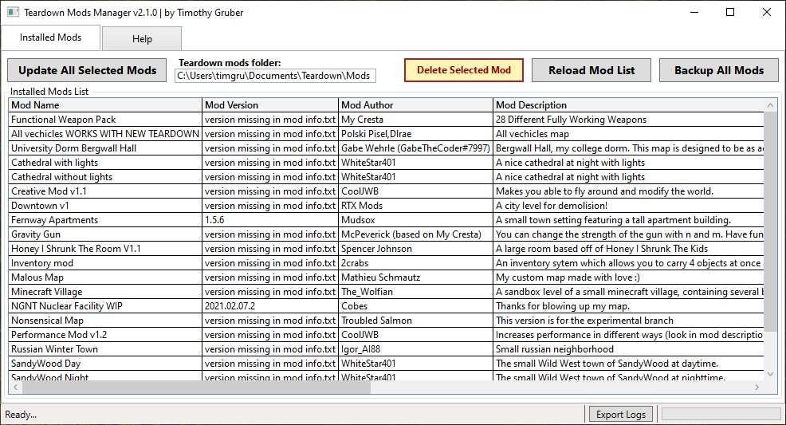

# TeardownModsManager
This script may be used to update, backup, and remove installed Teardown mods until until Steam Workshop availability in Teardown 0.6.

This is a work in progress, at least until Steam Workshop implementation in Teardown 0.6 potentially makes this obsolete.

If there are any issues, please create or report them here: https://github.com/tjgruber/TeardownModsManager/issues!

## How to use

### Via EXE:
The EXE is created using PS2EXE (PowerShell to EXE converter). Info about this is located here: https://github.com/MScholtes/PS2EXE
  1. Download the `TeardownModsManager.exe` file.
  2. Double click the .exe file to open.
  
### Via .PS1 script:
If you don't feel comfortable using the .exe, you may download the `TeardownModsManager.ps1` PowerShell script and follow below instructions.
  1. Download the .ps1 file to desktop.
  2. Right-click on the .ps1 file, then click "Run wtih PowerShell".

## General
This is a work in progress, and not all mods will work due to mod names not being consistent between teardownmods.com, mod name in info.txt, mod folder name, .zip not being used, mod packages containing multiple mods, etc. If a mod does not work, create a GitHub issue to let me know, and I'll see about writing a static code workaround for that mod to get it to work!

  * All mods are checked against teardownmods.com
  * The sign-in button is not functional, but the idea behind it was ability to sign-in to the site allow you to do more. Likely, will not get to it before TD 0.6.

## Mods Tab
For now, this script only works if mods are in default location.

Make sure to back up your mods location. By default, this is your `Documents\Teardown\mods` folder. Do this manually until I implement this function.

**Note:**
  > When a mod developer fixes naming consistency of a mod that was prevously inconsistent, you may get an error saying the mod could not be found after extraction. This is expected. Try reloading mod list, and trying again, as the error is correct, but it still likely updated just fine.

## Backup All Mods
This button is now functional as of v1.1.0-alpha.

This will back up your `Documents\Teardown\mods` folder to for example: `Documents\Teardown\mods_backup_132566554489856810.zip`.

**Note:**
  > This process can take awhile depending on how big your mods folder is. It can take around 30 seconds per gig. In my test, it took about 32 seconds to back up a mods folder that is 1.4GB.

## Mod Compatibility
Mod devs: to help ensure mod compatibility with Teardown Mods Manager...
As a mod creator or developer, the following practices can help ensure mod compatibility with Teardown Mods Manager:
  1. Mod name consistency is the biggest factor in your mod working with this app.
  2. Using a .zip archive is second biggest factor, until I feel like implementing other support.
  3.  Ensure mod `name = ` in mod info.txt matches the name of your mod at teardownmods.com.
  4.  Ensure mod name matches folder name, i.e. `Documents\Teardown\mods\mod name`.
  5.  Ensure `version = ` in mod info.txt is current released version at teardownmods.com. Something meaningful to the most amount of people, such as `2021.01.31.x` or `1.5.2` preferably for example. See semantic versioning: https://semver.org/
  6.  Ensure the last file in the downloads list at teardownmods.com for the mod is the regular default mod and is a .zip file.
  7.  Ensure name of mod folder is zipped: so extracting to Teardown\mods will result in `Teardown\mods\modName`
  8.  Instead of having multiple mods/maps, use mod options to control lighting, time of day, weather, etc.
  9.  Try to package mods together in the same mod folder that are part of the same mod package. That way I don't have to hard code a workaround.

## Media

