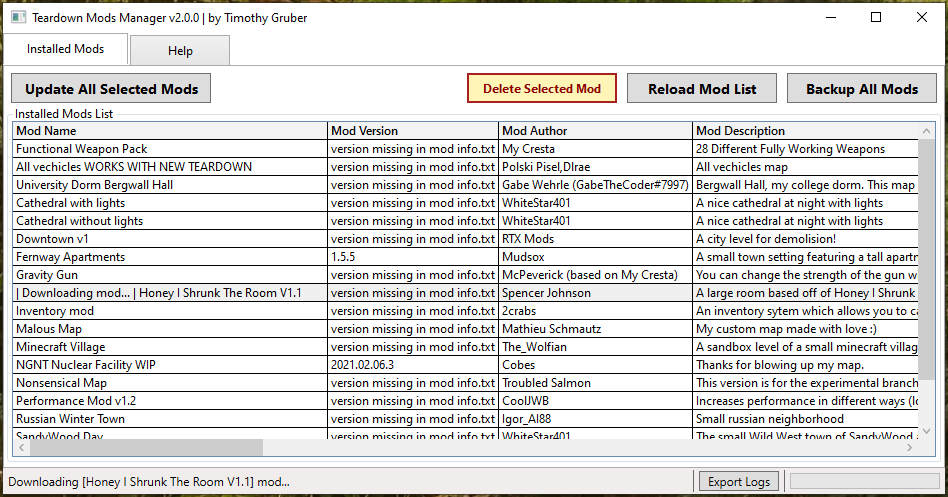

# Teardown Mods Manager
**Teardown Mods Manager** may be used to update, backup, and remove installed Teardown mods during the wait for Steam Workshop availability in Teardown 0.6, and possibly after.

## Recent Changes (v2.0.0 --> v2.1.1)
* Fixed missing variable that prevented some mods from properly being removed (v2.1.1)
* Added feature to display and change current mods folder location; Mods list reloaded automatically after changing directory
* Improved ModDir logic and basic mod validation. Requires info.txt to contain mod name or otherwise is ignored and not in mods list.
* Increased main window default size
* Changed Exe to require elevation to allow non-default mods locations outside of user profile
* Added additional help info
* Other various code fixes and improvements

## Previous Changes (v1.2.1 --> v2.0.0)
Teardown Mods Manager is now fully functional, including the following recent changes:
* No longer in beta status
* Added "Update All Mods" functionality
* Added "Delete Selected Mod" functionality
* Optimizations around updating all mods at once
* Added log function and improved logging
* Added Export Logs button
* Added ability to export log
* Removed Sign-in button
* Removed Update Selected Mod button
* Combined functionality of 'Update Selected Mod' and 'Update All Mods'
* Added multi-select enhancement
* Visual improvements
* Minor code enhancements
* Minor code fixes
* Fixed 'Gravity Gun' mod support

Now fully functional, but still a work in progress, at least until Steam Workshop implementation in Teardown 0.6 potentially makes this obsolete.

If there are any issues, please message me or preferrably, report them here: https://github.com/tjgruber/TeardownModsManager/issues!

*new v2.1.0*

*v2.0.0*

## How to use
There are two methods to using Teardown Mods Manager and the choice is yours to make. There is a Windows executable (TeardownModsManager.exe) and a raw PowerShell script (TeardownModsManager.ps1). Due to the nature of the .exe conversion, some platforms may falsly detect the .exe, in which case, if you have any doubts, you should look over and use the PowerShell script. The PowerShell script is open source (you're free to look at the code and download directly from GitHub).
### **Via EXE:**
The EXE is created using PS2EXE (PowerShell to EXE converter). Info about this is located here: https://github.com/MScholtes/PS2EXE
  1. Download the `TeardownModsManager.exe` file.
  2. Double click the .exe file to open.
  
### **Via .PS1 script:**
If you don't feel comfortable using the .exe, you may download the PowerShell script and follow the instructions below:
  1. Download the `TeardownModsManager.ps1` file to desktop.
  2. Right-click on the .ps1 file, then click "Run wtih PowerShell".

## General
All mods are checked against *teardownmods.com*. If you have any issues with a specific mod (or the app itself), use the **Export Logs** button to examine the logs and include them in your report.

> **Tip:**
If you delete a mod by mistake, you can reinstall it by selecting it, and clicking the Update All Selected Mods button. Once you reload the mod list, this is no longer possible, as the mod will no longer be shown in the *Installed Mods List*.

## Installed Mods Tab
Select the mods you wish to update, then click the **Update All Selected Mods** button. This can take some time if you select a lot of mods at once. Sometimes the downloads are slow, you can export logs while processing if needed.

On app load, all mods in the default mods folder should be displayed. The Cresta weapon pack is an exception, which handles them all as a single mod.

* Changing the default mods location is now supported, and will automatically reload the mods list with validated mods. **Click the mods folder path textbox to change.**
* Basic mod validation is used. If 'info.txt' does not exist or include mod name, it is ignored and not included in the list.
* Make sure to back up your mods folder. By default, this is your `Documents\Teardown\mods` folder. You may use the **Backup All Mods** button to do this for you.

> **Note:**
When a mod developer fixes naming consistency of a mod that was previously inconsistent, you may get an error saying the mod could not be found after extraction. This is expected. Try reloading mod list, and trying again, as the error is correct, but it still likely updated just fine.

## Backup All Mods
It should be said that the first thing to be done is backing up your mods. You can do this automatically by clicking the **Backup All Mods** button.

* This will back up your `Documents\Teardown\mods` folder to a zip file: `Documents\Teardown\mods_backup_132566554489856810.zip`.
* You can also do it manually and likely faster by copying and pasting a copy of your mods folder to somewhere else.

> **Note:**
This process can take awhile depending on how big your mods folder is. It can take around 30 seconds per gig. In my test, it took about 30 seconds to back up a mods folder that is 1.4GB.

## Mod Compatibility
Teardown Mods Manager supports updating mods archived with 7-Zip (.7z), WinRAR (.rar), and Zip (.zip).

As a mod creator or developer, the following practices can help ensure mod compatibility with *Teardown Mods Manager*:

  1. Mod name consistency is the biggest factor in your mod working with this app.
  2. Ensure mod `name = ` in mod *info.txt* matches the name of your mod at *teardownmods.com*.
  3. Ensure mod name matches folder name, i.e. `Documents\Teardown\mods\mod name`.
  4. Ensure `version = ` in mod *info.txt* is current released version at *teardownmods.com*. Something meaningful to the most amount of people, such as `2021.01.31.x` or preferably `1.5.2` for example. See semantic versioning: https://semver.org/
  5. Ensure the last file in the downloads list at *teardownmods.com* for the mod is the regular default or preferred mod download. This app selects the last file listed to download.
  6. Ensure name of mod folder is properly archived: so extracting to `Teardown\mods` will result in `Teardown\mods\Mod Name`
  7. Instead of having multiple mods/maps, use mod options to control lighting, time of day, weather, etc. If that doesn't work for you, create separate mods for them on *teardownmods.com*
  8. Try to package mods together in the same mod folder that are part of the same mod package. That way I don't have to hard code a workaround.

## Media

